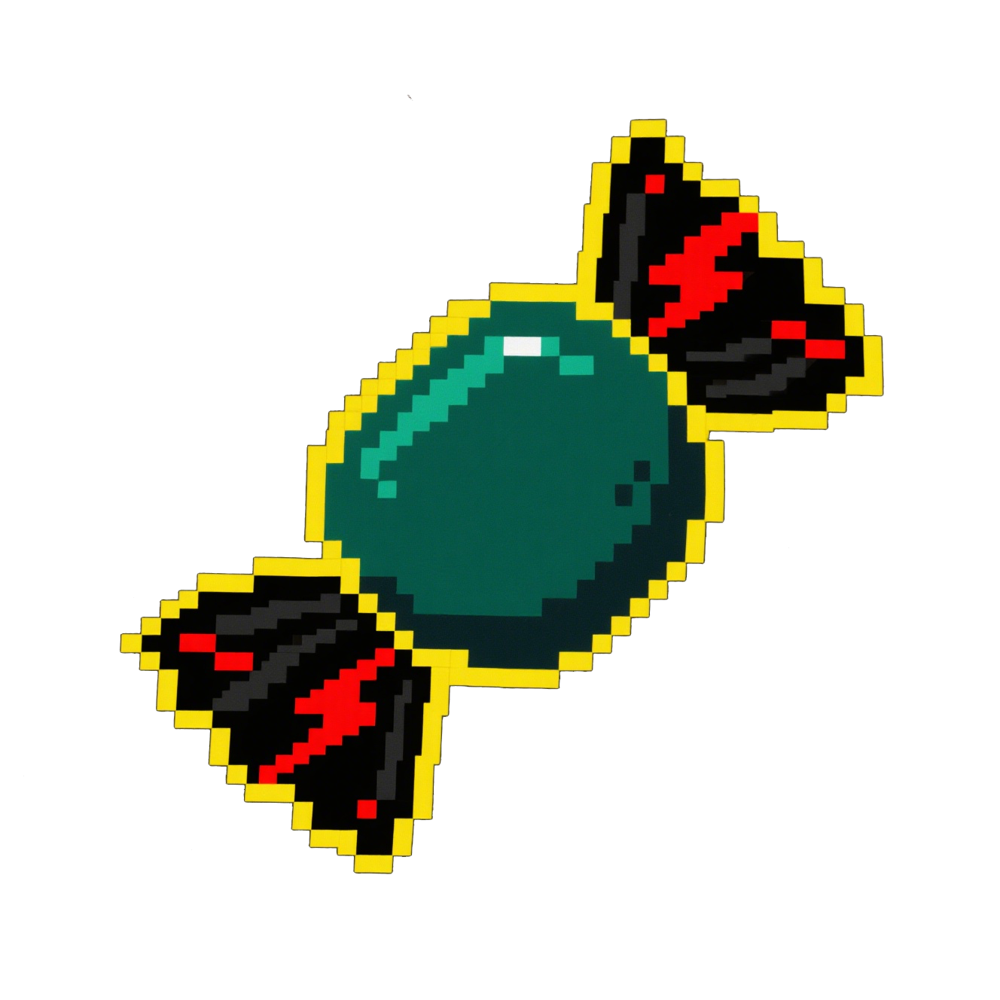

# Candy

A tiny web server built with rust.

## Features

- Simple and easy to use
- Single binary
- Supports SSL
- HTTP 2 support
- Supports lua script
- List directory

## TODO

[TODO.md](./TODO.md)

## Changelog

[CHANGELOG.md](./CHANGELOG.md)
